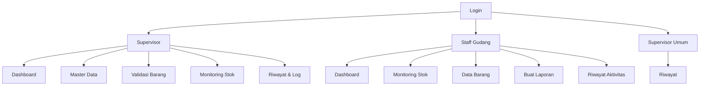

# Sitemap Sistem Aplikasi

## 1. Autentikasi

- Login Web
  - /login
  - /logout
- Login API
  - /api/login
  - /api/logout

## 2. Supervisor

Akses: role supervisor

- Dashboard Supervisor
  - /supervisor/dashboard
- Monitoring Stok
  - /supervisor/monitoring-stok
  - /supervisor/monitoring-stok/update-harga
- Export
  - /supervisor/exportcsv
  - /supervisor/export-pdf
- Master Data
  - /supervisor/master-data
  - /supervisor/master-data/{form_config_category}
  - /supervisor/master-data-store
  - /supervisor/master-data/{masterData}
  - /supervisor/master-data/category/{category_name}
  - /supervisor/api/master-data/{category}
- Validasi Barang Masuk
  - /supervisor/validasi-barang-masuk
  - /supervisor/validasi-laporan/{reportId}
  - /supervisor/validasi-pengajuan
- Validasi Barang Keluar
  - /supervisor/validasi/barang-keluar
  - /supervisor/validasi/barang-keluar/{reportId}
  - /supervisor/validasi-pengajuan-keluar
- Pemeliharaan
  - /supervisor/pemeliharaan-riwayat
  - /supervisor/pemeliharaan-validasi
  - /supervisor/pemeliharaan-validasi/{id}
  - /supervisor/laporan/{id}
  - /supervisor/export-laporan
- Riwayat
  - /supervisor/riwayat
  - /supervisor/riwayat-masuk/{reportId}
  - /supervisor/riwayat-keluar/{reportId}
  - /supervisor/log-aktivitas

## 3. Staff Gudang

Akses: role staff_gudang

- Dashboard Staff Gudang
  - /staff-gudang/dashboard
- Monitoring Stok
  - /staff-gudang/monitoring-stok
  - /staff-gudang/monitoring-stok/update-harga
- Data Barang
  - /staff-gudang/data-barang
  - /staff-gudang/generate-qrcode/{id}
  - /staff-gudang/preview-qrcode/{id}
  - /staff-gudang/store-qrcode
- Laporan
  - /staff-gudang/buat-laporan
  - /staff-gudang/kirim-laporan
  - /staff-gudang/form-pengajuan
  - /staff-gudang/kirim-laporan-pengajuan
- Riwayat Aktivitas
  - /staff-gudang/riwayat-aktivitas

## 4. Mobile App (Opsional, Side-by-Side dengan Web)

Aplikasi mobile sebaiknya dipisahkan sebagai cabang berbeda dari sitemap web karena tujuan fungsinya lebih ke operasi lapangan dan biasanya lebih ringkas.

- Login Mobile
  - /api/login
- Dashboard Mobile Staff Gudang
  - Overview stok, barang masuk, dan status cepat
- Scan QR / Pencarian Barang
  - /api/barang
  - /api/barang/{id}
  - /api/barang/scan/{qr_code}
- Laporan Mobile
  - /api/laporan-apk
  - /api/laporan-apk/{id}
- Riwayat / Status Pengiriman
  - /api/riwayat-barang
  - /api/notifikasi

Catatan:
- Mobile dapat menggunakan API yang sama dengan web, tetapi tetap dibuat sebagai cabang terpisah di sitemap.
- Jika ingin lebih rapi, sitemap bisa dibuat dalam dua kolom: Web dan Mobile.

## 5. Supervisor Umum

Akses: role supervisor_umum

- Riwayat Partner / Supervisor Umum
  - /partner/riwayat

## 5. API Umum

- /api/login
- /api/logout
- /api/barang
- /api/barang/{id}
- /api/laporan-apk
- /api/supervisor/validasi
- /api/supervisor/riwayat

## 6. Hubungan Antar Role

Diagram alur utama:

## 7. Ringkasan Fungsional

- Supervisor: mengelola data utama, validasi, monitoring, export, dan log aktivitas.
- Staff Gudang: mengelola stok, QR barang, data barang masuk, dan laporan aktivitas harian.
- Supervisor Umum: memantau riwayat kegiatan dan data yang terkait partner.

## 8. Catatan Arsitektur

Sistem ini berfokus pada tiga role utama dengan pembagian akses yang jelas:

- role supervisor = pengelola seluruh data dan validasi operasional.
- role staff_gudang = operasional gudang dan pembuatan QR/laporan.
- role supervisor_umum = akses pendukung / riwayat umum.
